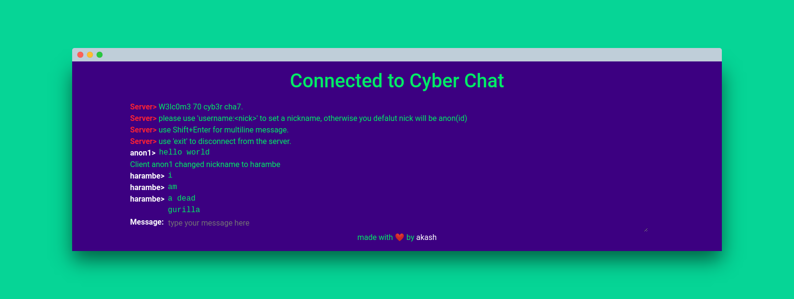

# cyber-chat

    a web chat application, with some basic chat functionality for people like HackerMan 👨‍💻
Live at: [cyber-chat](https://cyber-chat.herokuapp.com)

I made this app because my IP Messenger was not working and I had to send my friends some important nuclear codes. User can set a nickname and communicate with other connected clients. Can extend this app to show the online users.

Made using web socket sever and deployed using heroku.

A simple node app which a noob can understand.



a lot of things can be improved, raise an issue and start developing!

## local setup

- clone this repository using ```https://github.com/skywalker212/cyber-chat.git```
- make you working directory as cyber-chat using ```cd cyber-chat```
- run ```yarn install``` to install the required modules
- run ```yarn start``` to run the sever locally

you can also fork this repository and contribute.

## file structure

- ```app.js``` contains serverside code
- ```public\index.html``` is the client page which will be served.

## future improvement suggestions

- add oAuth
- make everything using react :P
- improve UI
- implement One on One messaging
- user firebase database instead of simple array (oh my god! array, really!!!)